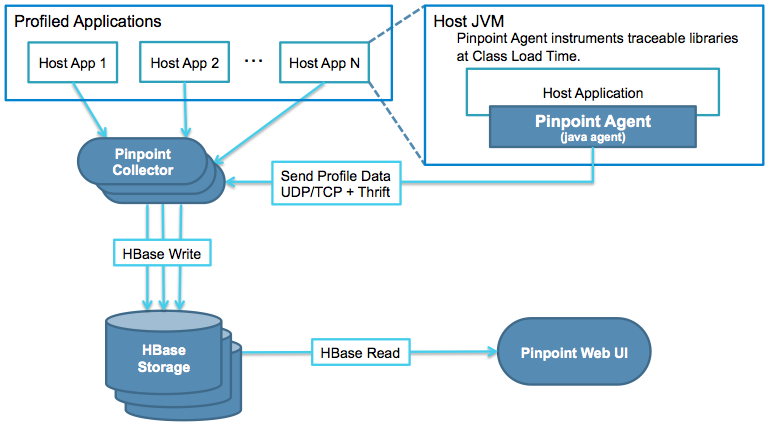

[](https://travis-ci.org/naver/pinpoint)

**Pinpoint** is an APM (Application Performance Management) tool for large-scale distributed systems written in Java. Modelled after [Dapper](http://research.google.com/pubs/pub36356.html "Google Dapper"), Pinpoint provides a solution to help analyze the overall structure of the system and how components within them are interconnected by tracing transactions across distributed applications.

* Install agents without changing a single line of code
* Minimal impact on performance (approximately 3% increase in resource usage)

## Latest Release (2015/11/23)
We're happy to announce the release of Pinpoint **v1.5.0**. <br/>
Please check the release note at (https://github.com/naver/pinpoint/releases/tag/1.5.0)<br/>
We're now focusing on developing **v1.5.1**.

## Overview
Services nowadays often consist of many different components, communicating amongst themselves as well as making API calls to external services. How each and every transaction gets executed is often left as a blackbox. Pinpoint traces transaction flows between these components and provides a clear view to identify problem areas and potential bottlenecks.<br/>
For a more intimate guide, please check out our *[Introduction to Pinpoint](https://github.com/naver/pinpoint/wiki#video-clips)* video clip.

* **ServerMap** - Understand the topology of any distributed systems by visualizing how their components are interconnected. Clicking on a node reveals details about the component, such as its current status, and transaction count.
* **Realtime Active Thread Chart** - Monitor active threads inside applications in real-time.
* **Request/Response Scatter Chart** - Visualize request count and response patterns over time to identify potential problems. Transactions can be selected for additional detail by **dragging over the chart**.

  

* **CallStack** - Gain code-level visibility to every transaction in a distributed environment, identifying bottlenecks and points of failure in a single view.

  

* **Inspector** - View additional details on the application such as CPU usage, Memory/Garbage Collection, TPS, and JVM arguments.

  

## Architecture


## Supported Modules
* JDK 6+
* Tomcat 6/7/8, Jetty9
* Spring, Spring Boot
* Apache HTTP Client 3.x/4.x, JDK HttpConnector, GoogleHttpClient, OkHttpClient, NingAsyncHttpClient
* Thrift Client, Thrift Service
* MySQL, Oracle, MSSQL, CUBRID, DBCP
* Arcus, Memcached, Redis
* iBATIS, MyBatis
* gson, Jackson, Json Lib
* log4j, Logback

## Quick Start
You may run a sample Pinpoint instance in your own machine by running four simple scripts for each components: Collector, Web, Sample TestApp, HBase.

Once the components are running, you should be able to visit http://localhost:28080 to view the Pinpoint Web UI, and http://localhost:28081 to generate transactions on the Sample TestApp.

For details, please refer to the [quick-start guide](quickstart/README.md).

## Installation
**Build Requirements**

* JDK 6 installed
* JDK 8 installed
* Maven 3.2.x+ installed
* JAVA_6_HOME environment variable set to JDK 6 home directory.
* JAVA_7_HOME environment variable set to JDK 7+ home directory.
* JAVA_8_HOME environment variable set to JDK 8+ home directory.

**Prerequisites**

Java version required to run Pinpoint:

Pinpoint Version | Agent | Collector | Web
---------------- | ----- | --------- | ---
1.0.x | 6+ | 6+ | 6+
1.1.x | 6+ | 7+ | 7+
1.5.x | 6+ | 7+ | 7+

HBase compatibility table:

Pinpoint Version | HBase 0.94.x | HBase 0.98.x | HBase 1.0.x | HBase 1.1.x
---------------- | ------------ | ------------ | ----------- | -----------
1.0.x | yes | no | no | no
1.1.x | no | not tested | yes | not tested
1.5.x | no | not tested | yes | not tested


**Installation**

To set up your very own Pinpoint instance you can either **download the build results** from our [**latest release**](https://github.com/naver/pinpoint/releases/latest), or manually build from your Git clone.
Take a look at our [installation guide](doc/installation.md) for further instructions.

## Issues
For feature requests and bug reports, feel free to post them [here](https://github.com/naver/pinpoint/issues "Pinpoint Issues").


## User Group
For Q/A and discussion [here](https://groups.google.com/forum/#!forum/pinpoint_user "Pinpoint Google Group").


## Wiki
We have a [wiki](https://github.com/naver/pinpoint/wiki) page for roadmap, user guide, and some documentation.
We welcome any documentation contribution.


## Contribution
We welcome any and all suggestions.

For plugin development, take a look at our [plugin samples](https://github.com/naver/pinpoint-plugin-sample "Pinpoint Plugin Samples project") project to get an idea of how we do instrumentation. The samples will provide you with example codes to help you get started. You can also join Gitter below for any questions regarding plugin development.

[](https://gitter.im/naver/pinpoint-plugin-sample?utm_source=badge&utm_medium=badge&utm_campaign=pr-badge)

Please make a pull-request against our `master` branch for contributions.

We would love to see additional tracing support for libraries such as [Storm](https://storm.apache.org "Apache Storm"), [HBase](http://hbase.apache.org "Apache HBase"), as well as profiler support for additional languages (.NET, C++).

## License
Pinpoint is licensed under the Apache License, Version 2.0.
See [LICENSE](LICENSE) for full license text.

```
Copyright 2015 Naver Corp.

Licensed under the Apache License, Version 2.0 (the "License");
you may not use this file except in compliance with the License.
You may obtain a copy of the License at

    http://www.apache.org/licenses/LICENSE-2.0

Unless required by applicable law or agreed to in writing, software
distributed under the License is distributed on an "AS IS" BASIS,
WITHOUT WARRANTIES OR CONDITIONS OF ANY KIND, either express or implied.
See the License for the specific language governing permissions and
limitations under the License.
```
